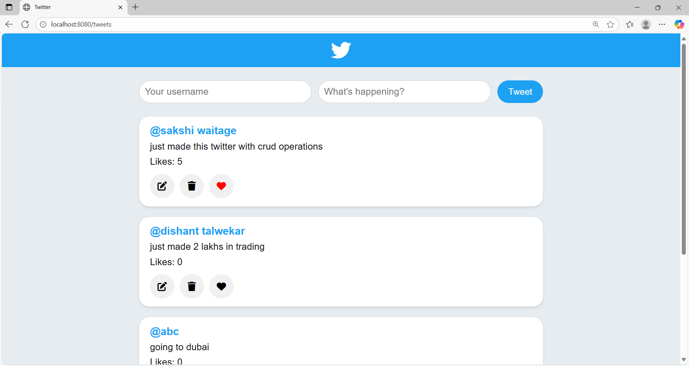
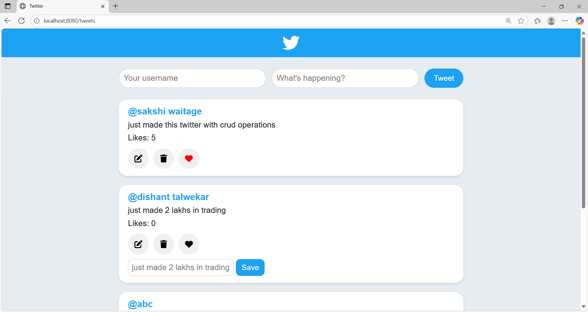

Mini Twitter with (REST)

A Twitter-like web application built with Node.js, Express, MySQL, and EJS.  
This project allows users to create, edit, delete, and like tweets with a simple and clean interface.

---

🔹 Features
- 📝 Post tweets with a username and content  
- ✏️ Edit existing tweets  
- ❌ Delete tweets  
- ❤️ Like tweets with a live counter  
- 🎨 Highlight tweets after liking  
- 📄 Dynamic rendering using **EJS**  
- 🗄️ Data stored in **MySQL**

---

🔹 Tech Stack
| Layer      | Technology |
|------------|------------|
| Backend    | Node.js, Express.js |
| Frontend   | HTML, CSS, EJS |
| Database   | MySQL |
| Other      | Method-Override (for PUT & DELETE requests) |

🔹 Screenshots

